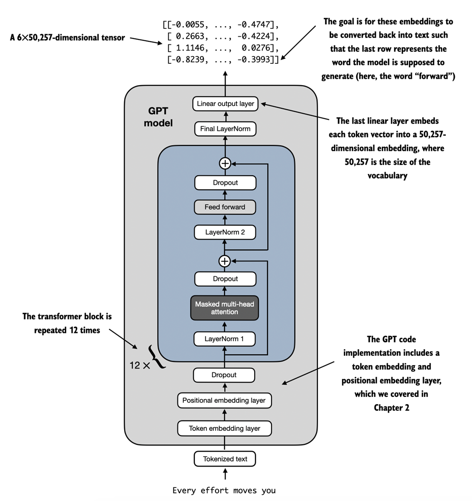

# GPT Transformer Model

## Overview
This repository contains the implementation of a GPT-like transformer model built using PyTorch. It's designed to handle a variety of natural language processing tasks, with a focus on both flexibility and performance.



*Figure: Simplified diagram of the Transformer architecture.*

## Features

- **Modular Design**: Easily interchangeable components for experimentation and upgrades.
- **Configurable**: Model parameters can be adjusted using a `config.ini` file.

## Prerequisites

Before you can run the model, you need to install the necessary dependencies:

```bash
pip install -r requirements.txt
```

## Configuration

Adjust model parameters by editing the `config/config.ini` file. Example settings:

```ini
[GPTModel]
vocab_size = 50257
context_length = 1024
emb_dim = 768
n_heads = 12
n_layers = 12
drop_rate = 0.1
qkv_bias = False
```

## Quick Start

To run the model with custom configurations:

```bash
python3 main.py --config_file path/to/your/config.ini
```

## Project Structure

```
gpt_transformer/
│
├── models/                # Transformer model components
│   ├── layer_norm.py      # Layer normalization
│   ├── gelu.py            # GELU activation function
│   ├── feed_forward.py    # Feedforward network
│   └── multi_head_attention.py  # Multi-head attention mechanism
│
├── config/                # Configuration files
│   └── config.ini         # Model configuration file
│
├── utils/                 # Utility scripts
│   └── tokenizer.py       # Tokenization utilities
│
│
├── main.py                # Main script to run the model
│
└── requirements.txt       # Python dependencies
```

